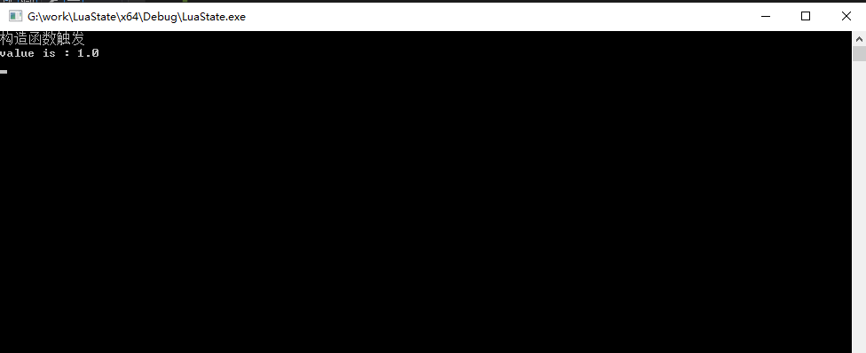

##Lua虚拟机相关

### 1. c++中的对象传入lua并在lua中销毁，是否会触发c++中的析构函数

不会。

main.cpp

```
#include "stdafx.h"
#include <windows.h>

#include "Test.h"

#include "lua.hpp"
extern "C"
{
#include <lua.h>
#include <lualib.h>
#include <lauxlib.h>
}


static int TestSetA(lua_State* L)
{
    Test** ppTest = (Test**)luaL_checkudata(L, 1, "test");
    luaL_argcheck(L, ppTest != NULL, 1, "invalid user data");
    int a = (int)lua_tointeger(L, 2);
    (*ppTest)->setA(a);
    return 0;
}

static int TestGetA(lua_State* L)
{
    Test** ppTest = (Test**)luaL_checkudata(L, 1, "test");
    luaL_argcheck(L, ppTest != NULL, 1, "invalid user data");
    lua_pushnumber(L, (int)(*ppTest)->getA());
    return 1;
}


static const struct luaL_Reg test_reg_mf[] =
{
    { "TestGetA", TestGetA },
    { "TestSetA", TestSetA },
    { NULL, NULL },
};


static int CreateTest(lua_State* L)
{
    Test** ppTest = (Test**)lua_newuserdata(L, sizeof(Test*));
    *ppTest = new Test;
    luaL_getmetatable(L, "test");
    lua_setmetatable(L, -2);
    return 1;
}

static const struct luaL_Reg test_reg_f[] =
{
    { "test", CreateTest },
    { NULL, NULL },
};

static int testModelOpen(lua_State* L)
{
    luaL_newlib(L, test_reg_f);
    return 1;
}


int newLuaState()
{
    int top = 0;
    lua_State* L = luaL_newstate();
    top = lua_gettop(L);
    luaopen_base(L);
    luaL_openlibs(L);
    top = lua_gettop(L);

    //加载模块
    luaL_requiref(L, "test", testModelOpen, 0);
    top = lua_gettop(L);

    //创建metatable
    luaL_newmetatable(L, "test");
    lua_pushvalue(L, -1);
    lua_setfield(L, -2, "__index");
    luaL_setfuncs(L, test_reg_mf, 0);
    lua_pop(L, 1);
    top = lua_gettop(L);

    int ret = luaL_dofile(L, "test.lua");
    if (ret != 0)
    {
        printf("%s", lua_tostring(L, -1));
    }
    lua_close(L);

    getchar();
    return 1;
}

int _tmain(int argc, _TCHAR* argv[])
{
    newLuaState();
    system("pause");
    return 0;
}
```

Test.h

```c++
#ifndef __TEST_H__
#define __TEST_H__

class Test
{
public:
    Test();
    ~Test();

    int getA();
    void setA(int a);

private:
    int m_a;
};

#endif
```

Test.cpp

```
#include "stdafx.h"
#include "Test.h"

Test::Test()
{
    printf("构造函数触发\n");
    m_a = 0;
}

Test::~Test()
{
    printf("析构函数触发\n");
}

int Test::getA()
{
    return m_a;
}

void Test::setA(int a)
{
    m_a = a;
}
```

test.lua

```lua
local t = require("test");
local test = t.test();
test:TestSetA(1);
print('value is : ' .. test:TestGetA());
test = nil
```

运行结果



在运行结束后没有触发析构函数。

查阅资料得知，lua和c++通信时所有的lua中的值由lua管理，c++中的值由c++管理，凡是lua中的变量，lua要负责这些变量的生命周期和垃圾回收。


### 2. lua state是否有内存限制

32位内存限制在1.8G左右，64位在本机上（16G内存）没有测出是否存在限制。

当lua state尝试分配内存时发现无内存可分配，会抛出异常，终止程序。

```c
/*
** generic allocation routine.
*/
void *luaM_realloc_ (lua_State *L, void *block, size_t osize, size_t nsize) {
    void *newblock;
    global_State *g = G(L);
    size_t realosize = (block) ? osize : 0;
    lua_assert((realosize == 0) == (block == NULL));
#if defined(HARDMEMTESTS)
    if (nsize > realosize && g->gcrunning)
        luaC_fullgc(L, 1);  /* force a GC whenever possible */
#endif
    newblock = (*g->frealloc)(g->ud, block, osize, nsize);
    if (newblock == NULL && nsize > 0) {
        lua_assert(nsize > realosize);  /* cannot fail when shrinking a block */
        if (g->version) {  /* is state fully built? */
            luaC_fullgc(L, 1);  /* try to free some memory... */
            newblock = (*g->frealloc)(g->ud, block, osize, nsize);  /* try again */
        }
        if (newblock == NULL)
            luaD_throw(L, LUA_ERRMEM);
    }
    lua_assert((nsize == 0) == (newblock == NULL));
    g->GCdebt = (g->GCdebt + nsize) - realosize;
    return newblock;
}
```

分配内存时，若无可用内存，lua会先执行一次gc，再尝试一次分配内存，若还是无可用内存，则抛出异常。


### 3. lua state global_state

global_state，也叫全局状态机，里面有对主线程的引用，有注册表管理所有全局数据，有全局字符串表，有内存管理函数，有GC需要的把所有对象串联起来的相关信息，以及一切lua在工作时需要的工作内存。

global_state只在lua虚拟机中是全局唯一的，所有的线程共享global_state，但是同的虚拟机间不共享global_state。

lua_state创建时的源码

```c
LUA_API lua_State *lua_newstate (lua_Alloc f, void *ud) {
    int i;
    lua_State *L;
    global_State *g;
    LG *l = cast(LG *, (*f)(ud, NULL, LUA_TTHREAD, sizeof(LG)));
    if (l == NULL) return NULL;
    L = &l->l.l;
    g = &l->g;
    L->next = NULL;
    L->tt = LUA_TTHREAD;
    g->currentwhite = bitmask(WHITE0BIT);
    L->marked = luaC_white(g);
    preinit_thread(L, g);
    g->frealloc = f;
    g->ud = ud;
    g->mainthread = L;
    g->seed = makeseed(L);
    g->gcrunning = 0;  /* no GC while building state */
    g->GCestimate = 0;
    g->strt.size = g->strt.nuse = 0;
    g->strt.hash = NULL;
    setnilvalue(&g->l_registry);
    g->panic = NULL;
    g->version = NULL;
    g->gcstate = GCSpause;
    g->gckind = KGC_NORMAL;
    g->allgc = g->finobj = g->tobefnz = g->fixedgc = NULL;
    g->sweepgc = NULL;
    g->gray = g->grayagain = NULL;
    g->weak = g->ephemeron = g->allweak = NULL;
    g->twups = NULL;
    g->totalbytes = sizeof(LG);
    g->GCdebt = 0;
    g->gcfinnum = 0;
    g->gcpause = LUAI_GCPAUSE;
    g->gcstepmul = LUAI_GCMUL;
    for (i=0; i < LUA_NUMTAGS; i++) g->mt[i] = NULL;
    if (luaD_rawrunprotected(L, f_luaopen, NULL) != LUA_OK) {
        /* memory allocation error: free partial state */
        close_state(L);
        L = NULL;
    }
    return L;
}
```

```c
/*
** preinitialize a thread with consistent values without allocating
** any memory (to avoid errors)
*/
static void preinit_thread (lua_State *L, global_State *g) {
  G(L) = g;
  L->stack = NULL;
  L->ci = NULL;
  L->nci = 0;
  L->stacksize = 0;
  L->twups = L;  /* thread has no upvalues */
  L->errorJmp = NULL;
  L->nCcalls = 0;
  L->hook = NULL;
  L->hookmask = 0;
  L->basehookcount = 0;
  L->allowhook = 1;
  resethookcount(L);
  L->openupval = NULL;
  L->nny = 1;
  L->status = LUA_OK;
  L->errfunc = 0;
}
```

通过lua_newstate创建一个新的lua虚拟机的时候，第一块申请的内存用来保存主线程和这个全局状态机，通过`preinit_thread`函数将global_state绑定到lua_state上。

尝试在两个lua虚拟机创建时分别打印它们的`l_G`的地址，发现是不一样的，结合源码可知lua虚拟机间不共享global_state。

